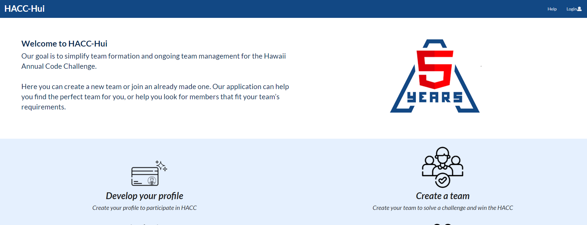
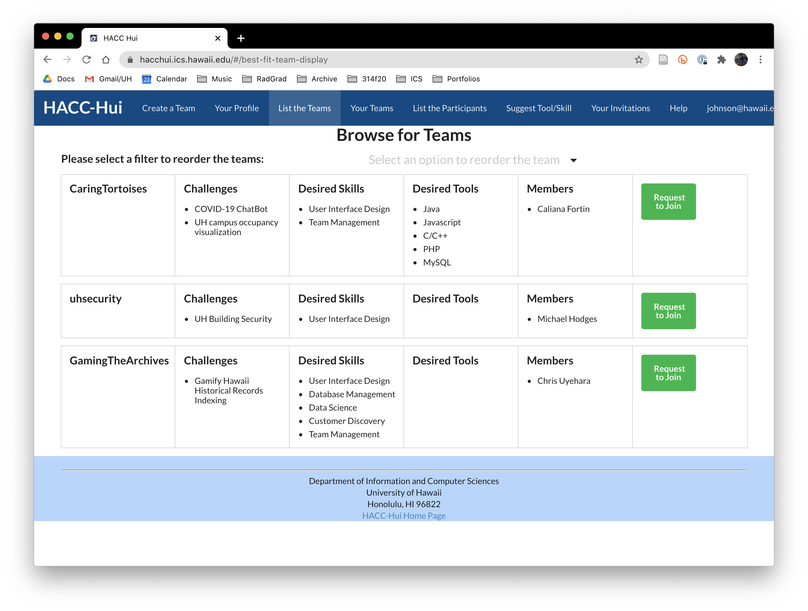
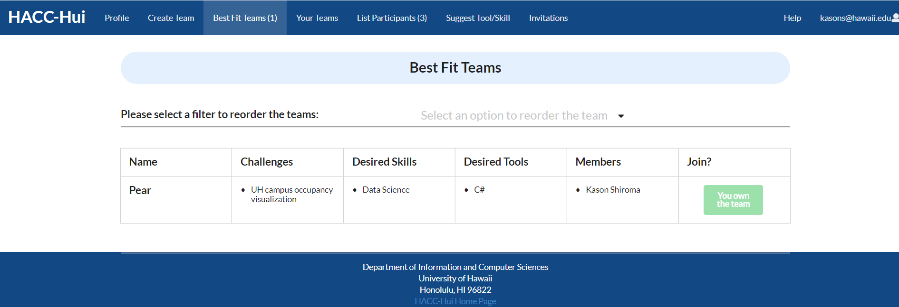

## What is HACC-Hui

HACC-Hui is a web based program designed to help participants in the Hawaii Annual Code Challenge (HACC) develop teams. With the obstacle of COVID-19 this year, participants would have found it more challenging than ever to form teams through this now virtual event. The purpose of HACC-Hui was to allow participants to communicate with one another and get to know each other, promote their teams and join teams that interest them. It's like Facebook but for the HACC.  

[The HACC-Hui website](http://hacchui.ics.hawaii.edu:8888/#/)

## My Contributions

This program was a group project for our ICS 414 class. For the final result, each member was responsible for their own portion of the project, although we were able to work with others if a section seemed to difficult. Part of my contribution was cleaning up the ui and bringing it up to modern standards. Particularly, I worked on the display of the best fit teams page—cleaning up spacing and aligning naming conventions. Since many people worked on this project, there were inconsistent naming for things. I also contributed to cleaning up the directories by deleting duplicate or unused files.

*Before image of the best fit teams*

Apart from the ui, I also implemented the desire to join functionality. Within the best fit teams page, I implemented a button for each displayed team indicating that the user is interested in joining. It then sends a Slack DM to the current members of that team. The team members can then go into HACC-Hui to a page called "Interested Participants" that brings up the data about the participant who clicked the button, and they can decide whether to add that participant or not. 

*After image of the best fit teams after my contributions*

## Team Process

In the first two milestones of our program development,we worked in separate teams ad every team would work on the same functionality for that milestone. Out professor would then pick and choose the best parts of each of our implementations and combine them into one cohesive master branch.

For this portion of the program development, I worked with Bryson Yuen, Moseli M and Matthew Kim. From the beginning, I had created the mock designs of what or website would look like, which majority of our ui was based off of. From there, I went on to creating the users profile page and the login functionality for Milestone 1. In Milestone 2, I worked on allowing the user to update their team page. 

After that, we moved to working as an entire class in the master branch due to time constraints, and the launch of the HACC was drawing closer. Matthew Kim and I continued to work together to implement the desire to join functionality.

## Ending Thoughts

Overall, this process aws a good experience into a real life application of web development for me. In contrast to ICS 314, this program was actually to be used so there was pressure to making sure it works and looks presentable to the public. 

I put a lot of work and passion into my 314 project, but it was still a bit rough since I was still fresh in web development. For this project, I had more experience and put more thought into how this would compare to similar programs in the market. All considering, I was pretty excited to have worked on this project.

Not everything went so smoothly though, as mentioned before, we did run into time constraints. I feel as if the organization and planning could have been better. The class did feel a bit rushed and we were required to put a lot of time into this project towards the beginning. Something I had to adjust to and learn to work around from my other clases. 

It was also a bit of a struggle coming back into web app development after a year. I had to relearn a few things that I forgot from ICS 314 at the same time as I was writing my implemntations, so the process took quite long for me. 

Another issue was that some parts of the project were developing slower than others, and they didn't meet up to par with the rest of the development. Since the class was moving along fast, it was a little hard to go back and clean up those parts.

I learned a lot through this experience in the end. I got to apply what I learned from ICS 314 again and discovered even more that I didn't know. I was surprised to hear that we would be implementing a Slack Bot functionality, and I think that was a valuable experience. This will definitely benefit me in the future as I'll have experience in an actual usable web app and experience working with different numbers of people. 