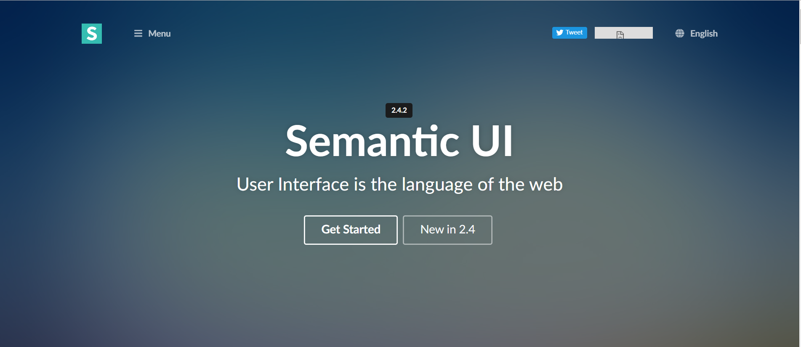
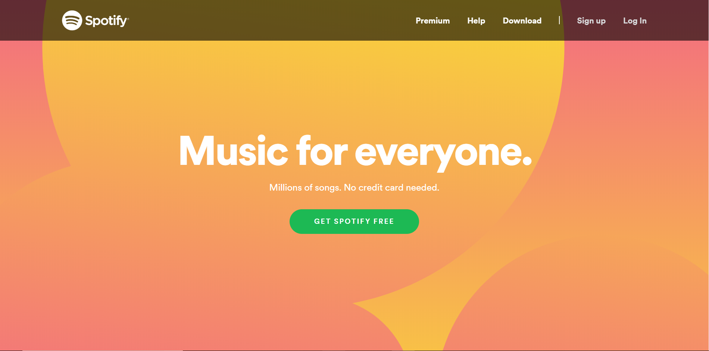

## Starting out

  When I first heard about Semantic UI and how it makes websites look more appealing, I was curious. What does that really mean? What kind of style does it implement to make websites look appealing? Is it easy to use? Well I found out that it’s really not easy to use. There’s a bunch of rules that you have to follow and different categories that do different things depending on what kind of layout you’re trying to create. But that’s not a bad thing. The detail and organization that comes with Semantic UI is more realistic than what I originally thought and it allows for a lot of possibilities in design.

## It's made for you

  Semantic UI has a nice organization of classes. Splitting designs into structures like collections and elements kind of reminded me of object oriented programming and helped me recognize the different functions of web pages. When I learned about classes I thought things like, “oh yeah, forms really do have a different structure than menus and other types of web pages” and it gave me a better idea of how to implement these properties in my own web design.

  The classes in Semantic UI also make it so you don’t have to implement your own classes and id’s for every html. Although it’s not “easy”, Semantic UI is great for faster styling and it’s like some of the work is already done for you. I was able to focus on what to put on my web pages and what it would look like, rather than how to implement the css for it.

## Being "trendy"

  I think the most important aspect of Semantic UI is how it generally makes websites look more modern. We live in an age where people’s attention spans are really tiny. Therefore, our web pages need to look attractive and trendy or else no one would care. Having a set of tools like Semantic UI makes web designs consistent, familiar and up to date across the board. When users open a web page for the first time, they pretty much already know how to use it. A button shades when you hover it and it’s design gives you the urge to click it. Text boxes appear indented and looks like it’s waiting for your input, and you can always find the main menu bar at the top of the page. All these components and a trendy design make viewers stay and can even boost the popularity of your website.

## Takeaway

  With my personal experience, I think Semantic UI is really fun to learn and very valuable for my future as a computer programmer. It, along with HTML, has introduced my to the front-end of programming and it showed the potential for creativity that can come with web development. It’s something very different than C++ or Java, but I actually enjoy doing it and wouldn’t mind exploring more about it in the future.
