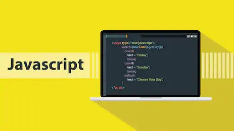
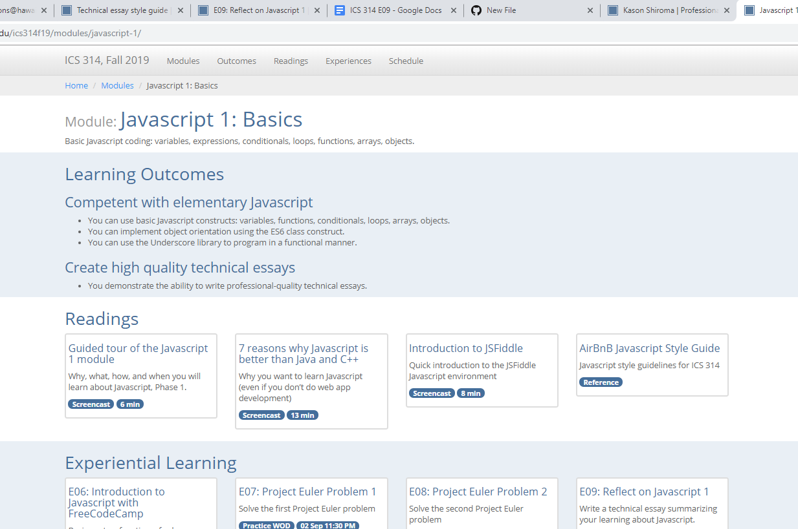

## Early Thoughts on Javascript

Just about every ICS class I’ve taken has taught me a different language from the bottom up. Right now, I’m familiar with the basics of Java, C, C++ and yeah even pseudocode. Java and C in particular were pretty different from each other and it took some getting used to learning C. When I first heard about Javascript, I figured it must be somewhat similar to Java and after 132 lessons on FreeCodeCamp and a week and a half into this class, I still feel the same way!

Yes, there are many differences between the two and I feel like my opinion will surely change, but compared to C, Javascript feels more 
similar to Java. This language feels super user friendly and is totally practical for things like web development (also not tracing pointers again is such a relief). There are a lot of functions that make this language efficient to use but seems even simpler than Java at times. Not having to use specific data types such as int or string when initializing a variable or not putting return types for function definitions were surprising to me. And not just that, the more I learn about the language, the more I find out about the amount of freedom you have with the syntax. A lot of things that you’re restricted from doing in Java and C is allowed in Javascript which makes more sense to me now in hindsight. Especially in regards to ES6, the updated version of Javascript. There are a lot of new features in there that are still foreign to me, but from what I know so far, ES6 creates many shortcuts for the programmer and shortens a lot of lines in their code. I feel like if I get familiar with these new features, it will save me a lot of  time writing code in the long run.

## Working Out Solutions

One thing that I think will help me improve my knowledge of Javascript the most is our Workouts of the Day (WOD). I think the whole athletic software engineering is a good idea. As someone who goes to the gym regularly in the semester, I think it’s important to be a bit strict when it comes to time because it helps manage one's efficiency. The modules and the way our schedule is structured allows me to plan out my work ahead of time and helps me think of what's the most efficient way to complete an assignment. I also believe that repetition is the best way to learn or improve on something. Just like the gym, if you’re doing something for the first time, you should do it a few more times to adjust to it. I like the WODs because I’m limited to a certain amount of time, which trains my brain to work efficiently. Also doing one practice WOD, group WOD, and class WOD a week helps me adjust to how programming  may actually be like outside of school and helps me retain new things I learn about functions and the syntax of Javascript.

## Takeaway

Overall, I believe Javascript is a good language to know and I’m glad to be learning it in ICS 314 with the athletic software engineering pedagogy. Both Javascript and ASE provides me with a new perspective on how to write programs and I hope they improve my efficiency in coding . Also, all the programs we’re using within Javascript and the extra resources that I’ve stumbled upon have been teaching me more about what web development is all about and is increasing my interest in it greatly! I find all these tools incredibly valuable and hope it helps me decide on where I really want to go in computer science.
