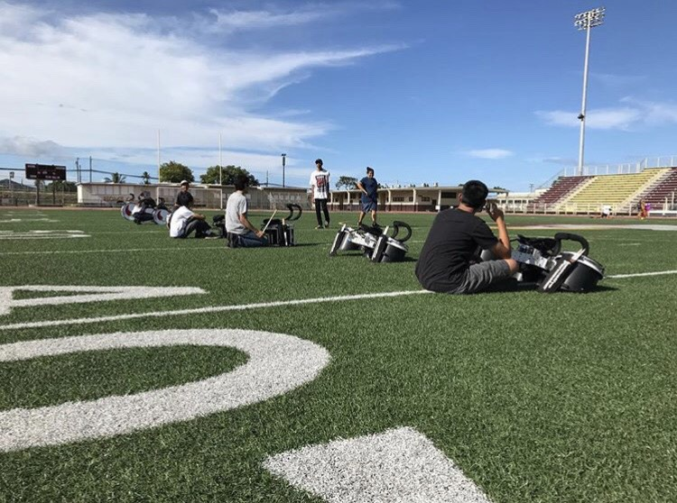

## Introduction

From 2013-2017 I was in drumline in my high schools band. We would do things like enter competitions, march in parades, and cheer on our
football team and hype up the crowd. When I started my junior year, I was chosen to be the section leader for the drumline. I helped guide
my section which taught me skills on managing a group and teaching how to play drums. 

As section leader, I was in charge of things like managing when we had practices, assigning players to drums, teaching the underclassmen 
drumline techniques, and correcting mistakes in the group as a whole so we could play clean and in time. Typically, drumlines also put more hours in than 
other sections of the band, so we had to work around every members schedule.

## What I learned

Being the leader has taught me how to not only manage my time, but how to manage availability of every member in a group. It was crucial 
for some areas of the drumline (such as the bass drums) to play together and with every member present, in order to improve effectively. 
With things like that in mind, I had to communicate with members and make sure they had time for our practices. I also learned techniques
on teaching players how to drum and efficient practice strategies to building chops and improving muscle memory. 
