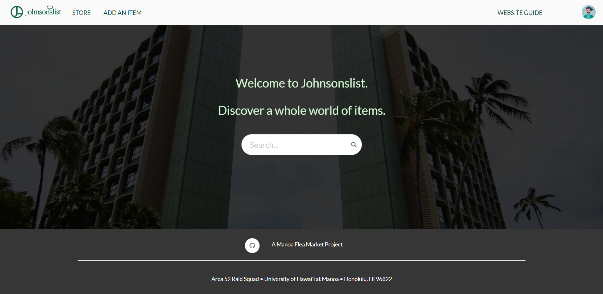

---
layout: project
type: project
image: images/JLlogogreen3.png
title: Johnsonslist
permalink: projects/johnsonslist
date: 2019-12-17
labels:
  - Web Development
  - HTML/CSS
  - Javascript
  - Meteor
  - Semantic-Ui React
  - MongoDB
summary: For my ICS 314 course, I created a buyer and seller website dedicated to the UH Manoa community. Students can post listings that they want to sell and contact potential buyers  to meet up with them somewhere on campus.
---

## Introduction

In my junior year studying computer science at UH Manoa, I had taken a software engineering class called ICS 314. The whole class was centered around website development and team-oriented development. Towards the end of the semester, we put our skills we developed to use by working in teams, creating an organization and developing our own website. 

My group and I was tasked with creating a site with the concept of a flea market for the UH Manoa community. It would allow students and faculty to post items they wanted to sell and buy items from other users. Our first order of business was to create a website name, and since the theme was very similar to Craigslist we came up with the title Johnsonslist (Johnson being the name of our professor for the class). 

## Planning and Functionality

Our team development process followed the guidelines of Agile Project Management. More specifically, for Issue Driven Project Management. Through GitHubs project boards, we created milestones dividing our tasks into three sections for our website development. Inside each project board, we created issues each unique to one member of the group. This form of management helped us work more independently on each task. Causing less interference and minimizing merge conflicts when updating our code.
  
As for how our site works, well we agreed on having a store page, an add item page, profile page, and some extra options relating to the users preferences. The store page was the main page that displays all the items available for sale. They had the username and email of the person who created the item, so that buyers could get in contact with the seller to organize meet ups on campus. Each member of our organization mostly sets issues based on each page, so the share of work was fairly divided. Some issues were a little more difficult than others and they would stretch across multiple milestones. The search bar in particular was split into multiple components and spent some time in all three milestones. It started off with filtering items only in the store page. Then we wanted to pass values from other pages and redirecting the user to the store page. Lastly, it was finalizing the design and fitting the aesthetic of the search bar to our website. Many components of the project were new to us, so it required a lot of time to research. But, our site wouldn't be complete without them! So we were eager to learn and pick up new things. 

## What I learned

This project required a lot of time management and constant communication from all our members. A whole semesters worth of instruction was needed just to learn how to get the ball rolling. From there, a lot of independent research was needed to make our website alive and convincing as a real online site. This taught me a lot about HTML and Javascript implementations, effective organization practices, and working with constrained deadlines. It gave me a lot of experience in website development and piqued my interest in developing applications.

[Here's our organization for our project.](https://github.com/Johnsonslist)

